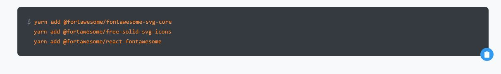
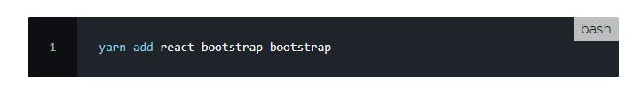
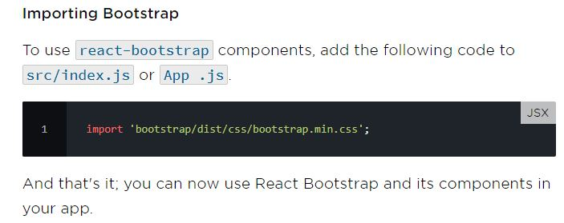
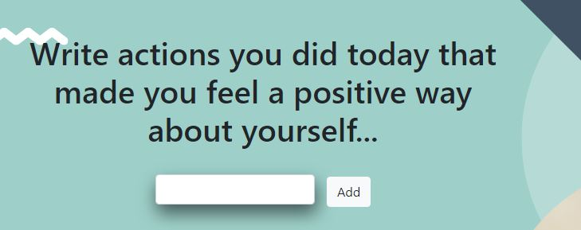
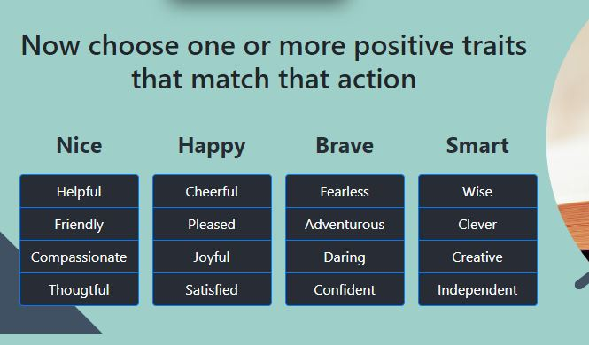
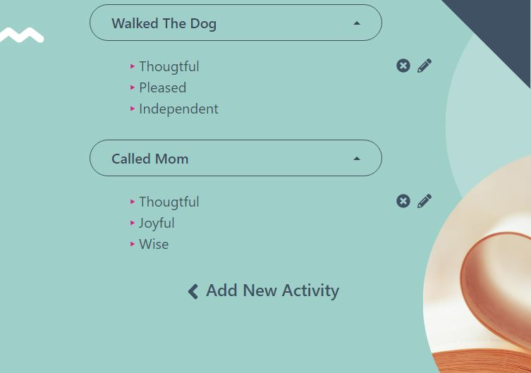
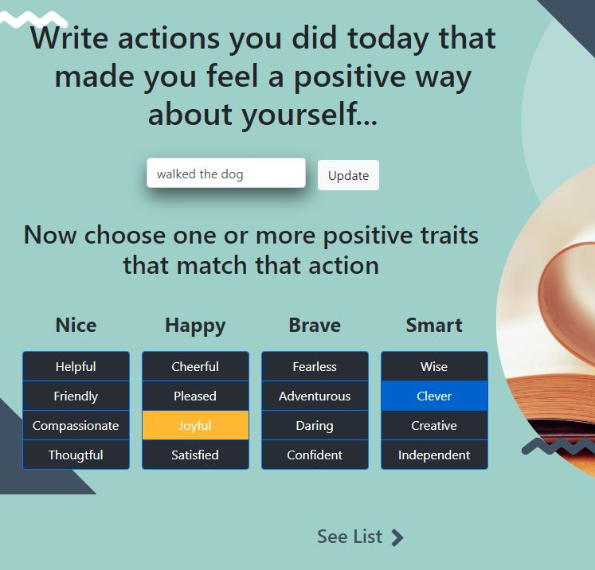

# Installations and dependencies

## Yarn

Run yarn to install packages and yarn start to run your development build.

The app will run on http://localhost:3000 as the default port.

## React FontAwesome

Font Awesome now has an official React component that’s available for a friction-less way to use our icons in your React applications.

To get started you’ll need to install the following packages into your project using a package manager, yarn. Here are examples that install everything you need and our solid style of icons using each respective package manager.

## React Bootstrap

To install react-bootstrap as a dependency, run the following command in your React project root directory.

# WayToGo!

## _Let's recall those positive moments of your day, shall we?_

## About

---

WayToGo! app aims to improve the way people perceive their every day to day life in a more positive way. Through a **perfectly build form** and a **colorful checkbox** you can document activities you did during the day that made you **feel good about yourself** and then select from a list one or more positive traits or emotions that matches that activity.

## How do you document your activities and positive traits or emotions

---

### WayToGo! app is divided into four main parts:

1. **Add Activity Form**

This is where you are going to type the activity that made you feel good about yourself

2. **Positive Traits Checkbox list**

This is where you select those traits or emotions that match that specific activity.

3. **List of activities documented**

Here you have a list of well-documented activities and inside each activity their matching positive traits or emotions. Each activity is documented in an accordion-type of the list. Next to each accordion, there is the remove button and an edit button showing as a pencil, each to remove or to edit the correspondent activity.

4. **Update activities view**

When clicking the edit button , you will be prompt to the Add Activity Page where the entire activity you chose to edit will show and the positive traits will lighten up. Here you can change the action and/or add or change positive traits. When done you can click the Update button and it will prompt you back to the list page again.

And if you would like to add a new activity, click the Add New Activity arrow

### WayToGoApp! Flowchart

: ​*This is a student project that was created at[CodeOp](http://codeop.tech), a full stack development bootcamp in Barcelona.*
